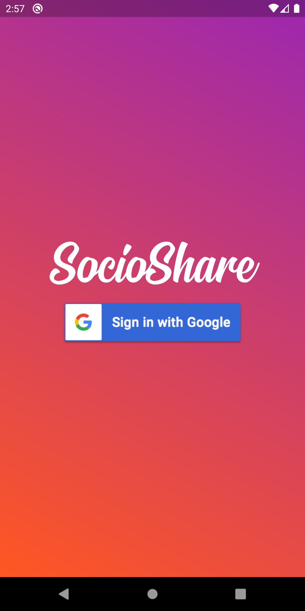
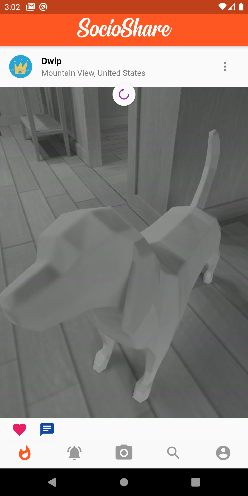
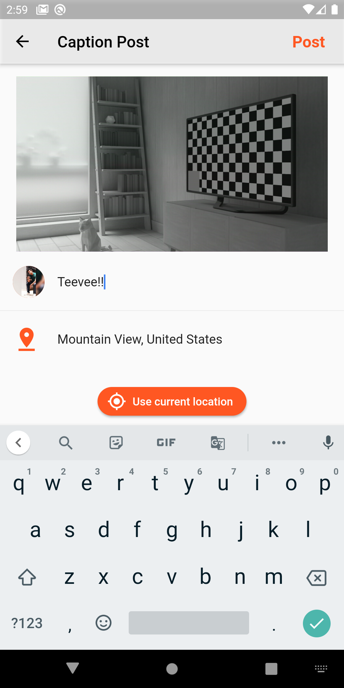
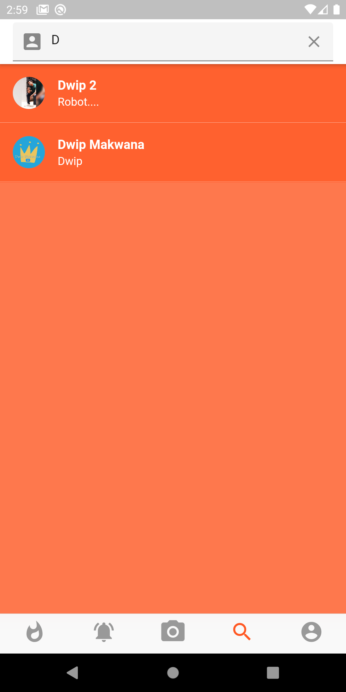
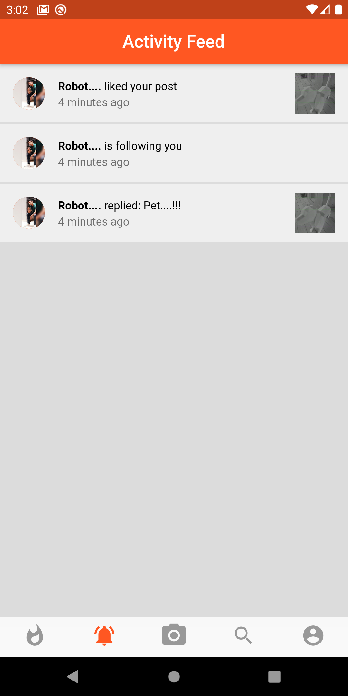
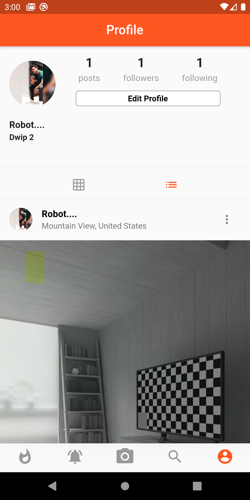
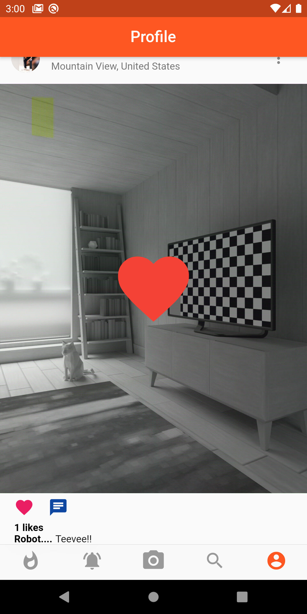
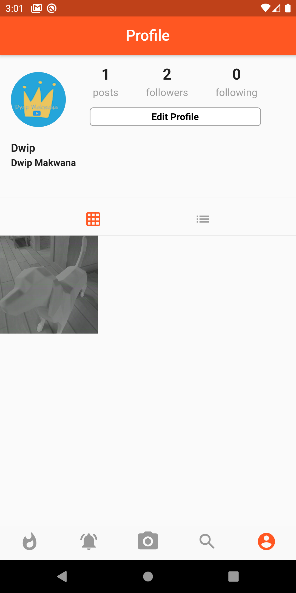

# SocioShare

It is a social app just like insagram with basic functionalities.

## Motivation
It is a personal project developed by me in VSCode using Flutter and Dart. It is basically developed for learning new skill in FLutter by having a overview on the language and implementing the experience.

## Tech/framework used

<b>Built with</b>
- [Flutter](https://flutter.dev/)
- [Dart](https://dart.dev/)
- [VSCode](https://code.visualstudio.com/)

## Screenshots

❮img src="screenshots/Screenshot_1589275665.png" width="100" ❯

## Contribute
I'm welcome to any ideas to contribute.

## License
[MIT](https://choosealicense.com/licenses/mit/)
